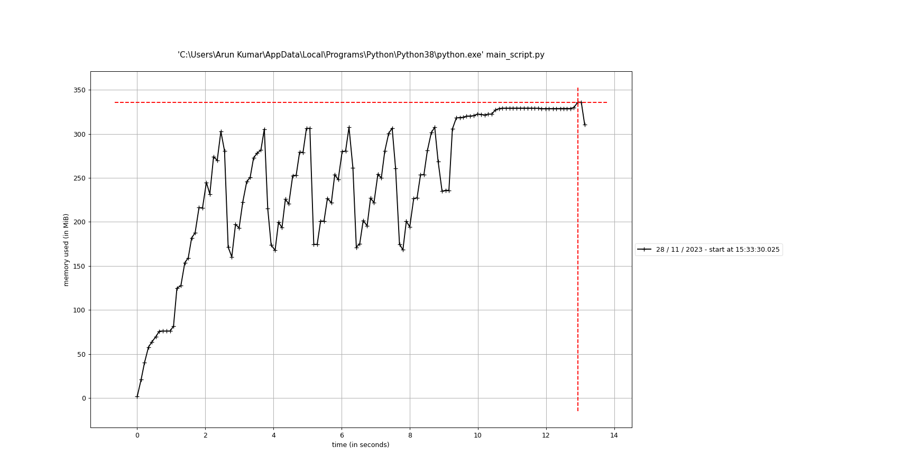

# Virtual Keyboard with Hand Tracking

This project implements a virtual keyboard controlled by hand gestures using a webcam. Users can interact with the virtual keyboard by hovering their index finger over the keys and performing various actions such as typing, deleting, and pressing special keys.

## Setup Instructions

### Prerequisites

- Python 3.8

### Installation

1. Install the required libraries:
   ```bash
   pip install opencv-python mediapipe pyautogui autopy
   ```

2. Clone the repository:
   ```bash
   git clone https://github.com/yourusername/your-repository.git
   ```

3. Navigate to the project directory:
   ```bash
   cd your-repository
   ```

4. Run the main script:
   ```bash
   python main_script.py
   ```

## Features

- **Virtual Keyboard**: Displays a virtual keyboard on the screen.
- **Hand Tracking**: Detects hand gestures using the MediaPipe library.
- **Typing**: Allows typing by hovering the index finger over the keys.
- **Deleting**: Supports backspace functionality for deleting characters.
- **Special Keys**: Includes special keys such as Caps Lock, Enter, Space, and Delete.
- **Caps Lock**: Toggles Caps Lock on and off.
- **Mouse Control**: Controls the mouse cursor using hand gestures.

## Project Structure

- **main_script.py**: Contains the main functionality of the virtual keyboard and hand tracking.
- **HandTrackingModule.py**: Provides a class for hand detection and tracking using MediaPipe.
- **profile_memory.py**: Profiles memory usage of the main script and displays memory usage over time.

## Usage

1. Run the `main_script.py` file to start the virtual keyboard.
   ```bash
   python main_script.py
   ```

2. Use your index finger to hover over the keys and perform actions.

3. Press the 'ESC' key to exit the program.

## Memory Profiling

The `profile_memory.py` script profiles memory usage of the main script over time and displays memory usage graphs segmented into three segments.

## Memory Usage Graph

Below is a graph illustrating the memory usage of the main script over time. This visualization helps in understanding the memory consumption patterns and identifying any potential memory leaks or optimization areas.

### Memory Usage Graph



- **X-axis**: Time (in seconds)
- **Y-axis**: Memory Usage (in MB)

To generate and update this graph:

1. Run the `profile_memory.py` script:
   ```bash
   python profile_memory.py
   ```

2. Save the generated graph image in the project directory.

## Notes

- Ensure proper lighting conditions for optimal hand tracking.
- Adjust the webcam position to accurately capture hand movements.
- The virtual keyboard performance may vary depending on the system specifications.
